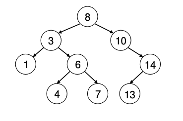

# Module 3 - Software Trends

### Overview

In order to handle large amounts of data, computers require software. How do computers actually deal with all that data? We start by discussing data storage and retrieval technologies and show how software or algorithmic “tricks” can substantially speed up computations. Then we talk about the fundamental drivers of cost and performance in software systems.

-   Discuss how software fits into analyzing large amounts of data
-   Use python to count the number of words and the most common word in a book
-   Discuss tradeoffs in distributed algorithms

### Resources

[1]. [Apache Lucene](https://lucene.apache.org/) - Free, open-source search engine library that provides full-text search capabilities

[2]. [Elastic Search](https://www.elastic.co/) - Distributed search and analytics engine that stores and indexes data for fast search, analytics, and relevancy

[3]. [Elastic Search Guide](https://www.elastic.co/guide/en/elasticsearch/reference/current/index.html) - Search and analytics engine that powers the Elastic Stack

## The Importance of Software

*Module 3.1 - The Importance of Software: An Example of Search Engines (8:47)*

### How Would You Make a Search Engine?

- Let's say you have all the web pages stored in a nice big table
- Start by looking through all pages for your search term
  - Assume it is 1 billion pages (which is the size of the web, to order of magnitude)
  - Look through 1 page every microsecond
  - Still would take *~15 minutes* to find pages that have your word
- Faster - Split pages with MapReduce
  - Still takes 15 min. of server time (expensive)
    - Would cost Google $0.05 per search *just for hardware!*
    - Interestingly, Google makes about $0.025/search in revenue (2 trillion searches, $50 billion in revenue) so that can’t be it!

**The answer is INDEXING**

### Indexing

- Go through pages and make a table called "index"

| Words |      Locations     |
|:-------:|:------------------:|
| Bear    | Page 1, 12, 14     |
| Cat     | Page 3, 6          |

- This would create a search in ~0.5 seconds
  - There are about 1 million words in English
  - So you can only look at 1 million words to see if they match "bear"
- Also how indexes work in back of books

**Improving Indexing**

- Utilize a tree
  - See Fig. Assume left early in alphabet, right late in alphabet
- Sort all the search terms and put them in a tree node
- Every tree node has the following property: all the nodes to the left are smaller, and all the nodes to the right are bigger
- If you do this, you need $\log_2 (1\times10^6) = 20$ operations

```{r, fig.show='hold', fig.cap="Tree Node", out.width="100%", fig.align='center', echo=FALSE}

```

**Indexing is a key technology**

- Used in a lot of places
  - Website logins to lookup your information
  - Airlines looking up your reservation

### Relevance Rankings

Relevance Rankings is another aspect of search

- When you search for things, you usually get rankings based on relevance
- How is "relevance" measured?
  - One major method - Term Frequency - inverse document frequency
  - To rank every document for its relevance to a query word
    - Take the number of times that word appears in the document
    - Divide by number of documents in your collection where word appears
    - Do for *every* document and sort by score
  - Rankings gives more weight to:
    - Terms that happen more often in a document
    - Terms that appear less frequently in documents searched
  
**Example: New York Times Archives**

- 50 articles per day, 365 days per year, 100 years (1.5 million documents)
  - These documents may use something like 200,000 words
  - 1.5 million articles * 8 bytes/word * 200,000 words = 2 TB
  - However, 1.5 million articles are likely 10 kb each = 10 GB
  - **This means the table is 200x more data**
- **Issue:** data is sparse
  - Every row has 200,000 columns, 1 for each word
  - Articles is < 1,000 words long so most values are 0
  - **Resolution:** "Column store" style
    - Table becomes 200,000 rows, 1,000 columns = 2 GB
    - search for a term, we can look it up and then read off all the document frequencies

| Word |      (Location, Frequency)     |
|:-------:|:------------------:|
| Aardvark | (doc 3, 4) (doc 1231249, 1) |
| ...      | ... |
| Zebra    | (doc 1, 2)                  |

### Relevance + Indexing

**Relevance + Indexing = Modern Search**

- Relevance scoring plus index-based storage do a really good job of searching many documents
- Open source library called Lucene (visit this module’s list of resources to access) basically implements this
  - Lucene is main code implementing what is discussed
- Google adds more pieces to their search (Naturally: Google spends $$$ on search technology, so this is a major simplification)
  - PageRank: a kind of popularity metric, where pages get importance based on how many other pages link to them (see this module’s resource list)
  - Other measures of quality: recency, images
  - Input from human search evaluators
  
### Purpose

- Often,compared to a naive way of solving a problem, things can be improved
  - Store data in ways that reduce space
  - Store data in ways that make questions we ask of data easier to answer
- Major domains of academic computer scientists
  - Binary trees
  - Sparse data storage
- Progress from data representation and clever algorithms is a bigger driver of improved computing than Moore's law
  - A particular algorithm has sped up 43 million times - 1000x from hardware, 43000x from software
  
### Summary

- How you structure data plays a huge role in system performance
- We talked through indexing as well as relevance scoring as they relate to modern search engines

**Key Points**

Software plays a critical role in building and optimizing a search engine. The process of structuring data is important for performance and efficiency.

**1. Naive Approach to Searching**

-   Searching through billions of web pages individually is highly inefficient, potentially taking 15 minutes, which would be too costly for companies like Google.

**2. Indexing**

-   A more efficient solution is indexing. By indexing words across documents, the system only needs to search a small subset of documents containing the desired word. This reduces search time significantly, down to microseconds. Indexing is widely used in databases, flight check-ins, and other information retrieval systems.

**3. Binary Trees for Speed**

-   Sorting indexed words into a binary tree allows fast searches by cutting down the number of operations required to find a word, reducing it to only 20 microseconds in a tree with a million words.

**4. Relevance Ranking (TF-IDF)**

-   Term Frequency-Inverse Document Frequency (TF-IDF) helps rank documents by their relevance to a search term. Rare terms carry more weight in this ranking process.
-   For example, a common word like "Congress" may rank lower than a rare term or a specific Congress member's name.

**5. Efficient Data Storage**

-   Representing data using a sparse matrix instead of a full table can save significant storage space. A document-word matrix storing 200,000 words across millions of articles may initially consume terabytes but can be reduced to gigabytes using a column-based format.

**6. Advanced Search Techniques**

-   Google uses additional metrics like PageRank (link popularity), recency, page structure, and feedback from human evaluators to refine their search algorithms.

**7. The Role of Algorithms**

-   Optimizing algorithms, alongside technological advancements (like Moore’s Law), plays a significant role in improving system performance, often more than hardware improvements alone.

\newpage
## Big Data or Just Data

*Module 3.2 - Big Data or Just Data (12:54)*

### Big Data vs Data?

- How fast computers can access the data they need depends on how, when and in what order they access it
- Databases are programs that store data in a particular way
  - Language to access specific pieces of data
  - Program contains algorithm for building indexes, using them, and returning results
  
### Two Database Queries

- Get information (e.g. average age) on everyone in zip code XXXXX
  - Find where info is stored on people
  - Check if zip code is XXXXX
  - Return information if true
- How many unique people live in zip code XXXXX?
  - Faster process
  - Maintain a list of unqiue addresses
  - For each zip code, store info about each person (rest of address, age)

### Current Database World

- Most database functionality is designed around e.g.commerce:
customers, transactions, products
  - Need high availability
  - Read and write at same time
  - Looking up minimal info
- Analyzing data is different
  - How many transactions occurred?
  - Which customer is most similar to customer A?
  - Requires looking at all data

### Databases

- Relational database
  - Data stored in tables
  - Items in tables can be references to other tables
- Row vs column stores
  - Row stores: Adding new data/looking data up
  - Column stores: Analyzing **whole data set**
  - SQL: Structured Query Language
- "NoSQL" database
  - Databases with less structure
  - NoSQL is a marking buzzword, "Not only SQL"
  - NoSQL always does something that is a subset of SQL functionality

### Structured Query Language (SQL)

- SQL language for creating views of tables or statistics that are useful
- Benefits:
  - Structure of tables can represent rich relationships between the data
  - Look at very specific combos of data
- Costs:
  - Need to create very detailed schema for your data
  - Hard to scale detailed interactions

**Examples of Relational Databases**

- PostgreSQL - Open source
- MySQL - Open source, owned by Oracle
- Oracle Database - Expensive, many features
- Microsoft SQL Server - Cheaper than Oracle

### Key-Value Stores

- Opposite end of data storage
  - Each key has a "value" which data is associated with it
  - In its purest form, the only question you can ask the database is "What is the information on SSN XXXX"
  
- Benefits:
  - Relatively easy to scale, fast, no need to worry about a schema
- Costs:
  - Cannot do complicated queries without looking at all the data (looking up every key)
  
- Examples
  - Key value stores are used for temporary access in memory
    - Redis
    - Memcached
    - Amazon Elasticache
  - Long term storage on disk
    - Amazon S3 - a large key vale store which scales well

### Document Oriented Database

- Instead of rows and tables, there are a bunch of "documents" which have different combinations of fields
- **Benefits:**
  - Support querying: Get all emails from XXX
  - Different docs have different fields: If each document pertains to a family, not all families have children
  - Scale better than relational databases
- **Costs:**
  - Can't query arbitrary relationships
- These databases are somewhere between simple key-value stores and full relational databases
- Examples - MongoDB and ElastiSearch
  - We will use ElastiSearch to store the Enron emails

### Tabular Databases

- Relational databases have rich relationships between tables
- Tabular databases allow arbitrary querying on just a single table
- **Benefits:**
  - Full querying availability for single table
  - Scales fairly easily - Different rows on different computers
- **Costs:**
  - Only single table, can't model complex relationships
- Tabular databases are kind of like key-key-value stores with extra functionality

**Examples:**

- BigTable - Google’s proprietary implementation - they published a paper which everyone implemented
- HBase/Cassandra/Hypertable - open source implementations of Google’s BigTable paper
- Accumulo - another open source implementation, developed at NSA, with “cell level security”

### Other Big Data Databases

- SQL on Hadoop
  - Relational databases built for availability for transaction processing
  - Build relational databases on top of Hadoop
  - Gives full scalability and full relationships
  - The only problem is some queries can require lots of looking at references across different computers, etc, so this can be super super slow.

- Examples
  - Hive - Creates relational databases in Hadoop
  - Impala - Hive but faster
  - Spark SQL - Create relational databases in Spark (like Hadoop but stores data in memory as much as possible)

### Summary

- Databases are programs that store data in a particular way, and use languages to access that data
- 3 types
  - Relational - Items in one table reference other tables
  - Key-value Stores - Fast way to access a value for particular key
  - Tabular - arbitrary querying on just a single table
  
SQL is the language used to create views of tables and statistics.

Big data isn't necessarily different from regular data, but the way it's processed, stored, and accessed makes the difference. Also various types of databases and their architectures are examined and how they handle different data access and processing needs.

**1. Big Data vs. Regular Data**

-   Big data isn't a fundamentally different type of data. The distinction lies in how it's processed and stored, not in the data itself.

**2. Relational Databases**

-   SQL is the dominant query language.
-   Data is stored in tables, with relationships (e.g., customer-orders-products) that allow complex queries.
-   Examples include PostgreSQL, MySQL (open-source), Oracle, and Microsoft SQL Server (commercial).
-   Relational databases struggle with scalability, especially across multiple servers.

**3. Non-Relational Databases (NoSQL)**

-   Key-Value Stores: Simplest form of databases, where each key has a single value. They scale well but are slow for complex queries (e.g., Redis, Amazon S3).
-   Document-Oriented Databases: Store data in flexible formats like JSON, allowing for some querying but limited cross-document relationships (e.g., MongoDB, Elasticsearch).
-   Tabular Databases: Structured databases with single-table queries (e.g., Google's Bigtable, HBase, Cassandra).

**4. Scalability Challenges**

-   Scaling relational databases across multiple computers introduces performance issues due to the need for cross-table relationships. NoSQL databases are often preferred for big data due to their ability to handle scaling more easily.

**5. New Big Data Approaches**

-   Technologies like Hadoop and Spark have introduced new ways to store and query massive datasets.
-   Spark SQL offers more flexibility and speed than traditional Hadoop implementations by storing more data in memory.

**6. SQL vs. NoSQL**

-   SQL databases provide powerful, structured queries but are more rigid and complex.
-   NoSQL databases are more flexible and scalable but lack complex querying capabilities across datasets.

\newpage
## Programming Languages and Tradeoffs

*Module 3.3 - Programming Languages and Tradeoffs (8:19)*

### Tradeoffs

- Think about a computer
  - Loads stored data
  - Performs computations
  - Writes results
- If you micromanage every piece of this process, you can make the computer do a given task optimally
- In practice, this is very hard - we think in abstractions
  - Low level: Move bits to CPU register
  - High lvel: For loops, finding an element in list

### Levels of Programming Languages

- Interpreted (Python/R)
  - A program looks at the commands and then translates that into machine code
  - Rapid, interactive work
  - Slower than if compiled
- Compiled 
  - Compiling takes a long time
  - More ways to optimize on CPU
  - Programs faster

### Programming Languages Performance

- C is faster (compiled)
- Python/R slower (Interpreted)
- R and Python both call C functions for the most processing intensive functions

### Learn R/Python

- Community matters
  - Python/R strong communities
  - Most new statistical/machine learning methods are first published in R, then in Python, and never in C
- Some languages built more for some things than others
- R/Python 3x slower than C

### Python

- Easy to learn
- Elegant syntax
- Nice tools for data analysis
  - NLTK - Natural Language Toolkit
  - SciPy - Collection of programs implementing
    - Numpy - Low level numerical computation
    - Pandas - Higher level data analysis tools
    - Scikits - ML algorithms
    - Matplotlib - Plotting
    - Jupyter Notebook - More analysis centric way or organizing code and outputs than scripts

### R

- Uglier
- Most full featured statistical libraries
- Bigger data analysis community
- Easier to do basic data analysis

### Summary

- Programming languages are either compiled (ex. C) or interpreted (ex. Python and R)
- Interpreted languages like Python and R are slower than C, but are still useful due to their large communities and ability to execute the tasks they were built for well
- Python is relatively easy to learn and has nice tools for easy analysis
- R has the most full-featured statistical libraries and is easier to use for statistical analysis than Python

**1. Overview of Programming Languages**

-   Programming languages involve tradeoffs between efficiency and usability.
-   A computer executes tasks optimally when data is efficiently managed, but this is difficult to do manually.

**2. Abstraction Levels**

-   **Low-level abstraction** involves managing hardware directly (e.g., moving bits to a CPU register), which is hard to handle manually.
-   **High-level abstraction** simplifies programming with constructs like loops, lists, and neural networks.

**3. Interpreted vs. Compiled Languages**

-   **Interpreted languages (e.g., Python, R):** Source code is translated to machine code at runtime, resulting in slower execution but allowing for rapid iteration and interactivity.
-   **Compiled languages (e.g., C):** Code is translated to machine code before execution, which takes longer to compile but runs much faster once executed.

**4. Speed Comparison**

-   A chart compared different languages, with C as the baseline (fastest), and Python/R being much slower, especially in tasks like the Fibonacci sequence.
-   Despite Python and R calling C libraries for some functions, their interpreted nature makes them slower for tasks written in pure Python or R.
-   For matrix multiplication, a common operation in data analysis, Python and R perform nearly as fast as C, showing that their slower speed can be engineered around for specific tasks.

**5. Why Use Python and R?**

-   **Community and Libraries:** Both languages have strong communities, especially in data analysis and machine learning.
-   New Algorithms: Many new statistical or machine learning algorithms are first implemented in R or Python, not C.
-   **Python's Advantages:** Easy to learn with elegant syntax and strong tools like Jupyter Notebooks, SciPy, Pandas, and scikit-learn.
-   **R's Advantages:** Has more complete statistical libraries, a larger data-centric community, and simpler syntax for core data analysis tasks like regression models.

**6. Understanding Multiple Languages**

-   Learning both Python and R is essential to understand the differences between programming languages and appreciate that multiple tools can accomplish the same tasks with different strengths and weaknesses.
