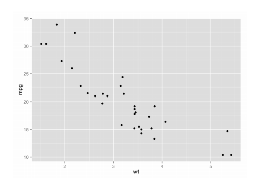
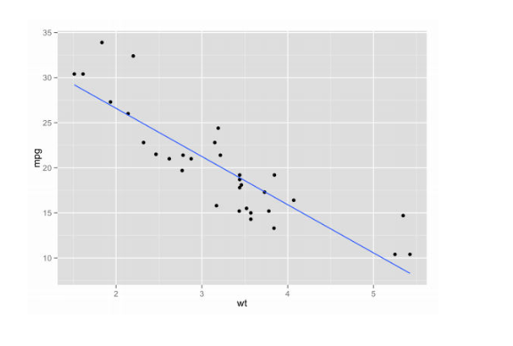
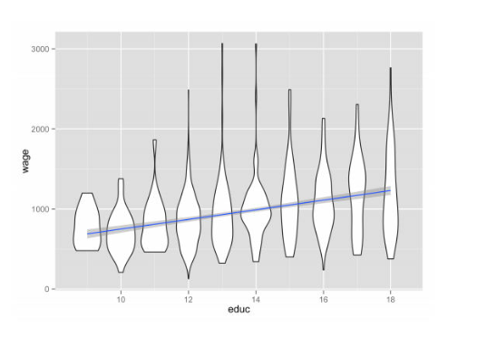

# Module 5 - Statistics

### Overview

There are many different types of statistical models. The vast majority are “parametric”, which means they have an assumption about how data are generated that depends on a number of different unknown variables or “parameters”. This includes linear regression, logistic regression, and a bunch of other things through to deep neural networks. In this module, we identify the common mathematical themes in all these models. We then talk about how to think about how these models intuitively and understand how they fail.

## Module 5.1 Linear Regression

### Regressions

- How do we determine the relationship between variables?
  - Think about it like a function: X goes in, Y comes out
  
```{r, fig.show='hold', fig.cap="Function of X and Y", out.width="70%", fig.align='center', echo=FALSE}
knitr::include_graphics("figures/m5.1-regression.png")
```

- Instead of a nice functional relationship, we have messy clouds of data

```{r, fig.show='hold', fig.cap="Scatter Plot with Data Points", out.width="70%", fig.align='center', echo=FALSE}

```

- The goal is to pick a function that fits the data "well"

```{r, fig.show='hold', fig.cap="Linear Regression Fit", out.width="70%", fig.align='center', echo=FALSE}
knitr::include_graphics("figures/m5.1-fit.png")
```

- What does it mean for this line to fit "better" than the last?

```{r, fig.show='hold', fig.cap="Linear Regression Better Fit", out.width="70%", fig.align='center', echo=FALSE}

```

- The main model we use is called "linear regression"
  - We will take a straight line (hence linear)
  - We want it to be near the data
  - The line which was "bad" was further away than seemed necessary
- We use an equation like:
  - $Y = \alpha + \beta X + \epsilon$

### The Regression Model

- This is not a math course, but let's look at what goes into this model
  - X, Y - random variables. We have draws of this data out of some population.
  - $alpha$, $\beta$ - Parameters. These parameters represent the relationship
  between X and Y
  - $\epsilon$ - This is the error terms. The other things which are not in X
  but affect Y
- More intuitively
  - If Y is education, X is schooling
  - $\Beta$ is the amount that an extra unit of schooling is associated with
  higher wages
  - $\epsilon$ represents other facts which are not school that also affect wages

### Predictions

- How does this relate to prediction
- We are trying to predict $y_i$ with $x_i$
- How do we do this?
  - We know the formula for $y_i$ from our model
    - $y_i = \alpha + \beta x_i + \epsilon_i$
  - But if we don't know $y_i$, we don't know $\epsilon_i$ either
  - The best we can do is:
    - $\hat{y}^i = \alpha + \beta x_i$
  - $\hat{y}^i$ is called the predicted value of y

### Wages and Education

- X is years of schooling, Y is wages
- Prediction

```{r, fig.show='hold', fig.cap="Wages and Education Fit", out.width="70%", fig.align='center', echo=FALSE}

```

### What Can We Model?

- What is Y?
- What is X?

### Examples

- Crime and Policing at the State Level
  - What is the sampling frame?
  - What is X, Y?
  
- Crime as a function of income from survey data
  - What is the sampling frame?
  - What is X, Y?

### Summary

- Next
  - Assumptions
  - Linear regression is a very simple model
  - We can discuss a wide variety of extension now that we know this model
  
- We try to predict an outcome random variable Y with an input random variable X
- To do this, we use a sample of pairs of $(x_i, y_i)$ observation
- We choose the "best" parameters to fit the model
- We get a relationship between X and Y that can be used for prediction or analysis

## Module 5.2 Assumptions for Linear Regression

### Assumptions

- In the least squares model, beyond some technical assumptions, the following
assumptions are sufficient for ordinary least squares (OLS) to work:
  - Data is random, independent draws from the population of X and Y
  - X is uncorrelated with $\epsilon$ (this actually is like assuming the model
  is "right", at least in the important ways)
- What does "work" mean?
  - It means your estimate of $\beta$ will be the right one
  - and hence, your predictions of $\hat{y}$ will also be good on average

### Thinking about Bias

- What happens when your model is wrong (aka every time)?
- There's a simple relationship in a simple linear regression
- Consider the case of schooling:

$$
  wage = \alpha + \beta educ + \epsilon
$$
  - But what if smart people go to school more and get more education?
  - Because we don't measure IQ, highly educated people will also have high IQ
  - Their wages will be extra high
  - Thus, the line of best fit will have a bigger slope, and it will look like
  educ is more strongly related to wages than is in fact true

### Extrapolation

- Extrapolation means using predictions outside the range of data where you fit
your model
- When would this work?
  - If your model is still "right" for new data
  - Regress wages on GPA for GA Tech grads in 2012 and 2013: Should be OK
    - Regress wages on GPA for GA Tech grads in 2012 and grads in France in
    2013: Problems
  - Typically we warn against extrapolation

- Extrapolation to new X
  - Can be OK if the model is right
  
```{r, fig.show='hold', fig.cap="Extrapolation", out.width="70%", fig.align='center', echo=FALSE}
knitr::include_graphics("figures/m5.1-extrapolation.png")
```
  
- But if your model isn't right you will have trouble
- Your model can be wrong for one of two reasons
  - 1. The relationship you found in the data doesn't hold for different values
  of X
  - 2. Unobserved factors which you can't control are different in a new sample

### Assumption: Data Drawn from Population

- Sometimes, this is a hard assumption to believe
- Example: Tweets
  - You want to look at the relationship between Tweet mood and the stock
  market
  - You create an average daily twitter mood and a stock market return variable
- Financial crisis vignette
  - A big problem was that the mortage backed secruities were split up and
  rated as AAA (very high quality)
  - To rate these securities, agencies look at the historical performance of
  comparable securities
  - Intuitively, a problem with this is that you have to assume that these
  sliced up securities were drawn from the same distribution as whether
  e.g., states repay loans

### Causality and Correlation

- "Correlation does not imply causality"
- $\beta$ is a measure of the correlation between X and Y
- When X is high, how high might we expect Y to be?
- What does this mean in the contect of education/earnings?
  - People who to school longer tend to make more money
  - But we don't know whether that's because they actually are more productive
  (assuming that productivity is related to pay)
  - Or whether there's another trait which predicts schooling and income
  (Ambition? Family background?)

### Causality

- How should we think about causality?
  - Imagine assigning a different value of X to an individual
    - Instead of me getting 21 years of education, maybe I got 16 instead
  - What would be the difference in my wages if I drew a different education
  level?
- Why do we care about this?
  - If we know the true relationship between X and Y, then we can safely
  extrapolate if we think that relationship should still hold

### Summary

- Bias exists in models and is harder to think through if the model is more
complex
- Extrapolation is when predictions are made outside of the range of data the
model was fitted in
  - Extrapolation is typically warned against
- "Causation does not imply correlation"

## Module 5.3 Generalizing Linear Regression

### Linear Regression Model

- X is years of schooling, Y is wages

$$
  wage = \alpha + \beta educ + \epsilon
$$

```{r, fig.show='hold', fig.cap="Wages and Education Fit", out.width="70%", fig.align='center', echo=FALSE}

```

### Find Line of Best Fit

- Think about what the residuals would look like if we moved the line around
  - They would grow!
- What we're doing is moving the line around (changing $\alpha$ and $\beta$)
to minimize these squared residuals
- Another name for this linear regression model is "least squares"
- For each data point you can write the equation:

$$
  y_i = \alpha + \beta x_i + \epsilon_i
$$

- So if you pick a particular $\alpha$ and $\beta$, you can calculate your
error, $\epsilon_i$:

$$
  \epsilon_i = y_i - \alpha - \beta x_i
$$

### Least Squares

So you have your expression for each residual, $\epsilon_i$

1. Square each one: $\epsilon_i^2$
2. Add them all up: $\sum_i \epsilon_i^2$
3. This is just a function that depends on your data and your parameters of
interest:

$$
  F(\alpha, \beta) = \sum_i \epsilon_i^2 = \sum_i (y_i - \alpha - \beta x_i)^2
$$
4. Find $\alpha$, $\beta$ to minimize $F(\alpha, \beta)$

**These are your estimates.**

### Law of Large Numbers

- How does the law of large numbers relate?

$$
  F(\alpha, \beta) = \sum_i \epsilon_i^2 = \sum_i (y_i - \alpha - \beta x_i)^2
$$

- Think about $\alpha$, $\beta$ as not random - Just numbers like 3 or 7.2
- $x_i$ and $y_i$ are summed up, so they are like sample averages
- So you get a kind of combined average function

$$
  F(\alpha, \beta) \approx \lambda_i(\alpha, \beta) = E[\lambda(\alpha, \beta)]
$$
where $\lambda_i(\alpha, \beta)=(y_i - \alpha - \beta x_i)^2$.

- If we have large samples, the $\alpha$ and $\beta$ we choose are the ones that
optimize this function

### An Aside on Estimation

- We can estimate any function of this form by just taking the sum of the
individual data components

$$
  F(\alpha, \beta) = \sum_i \epsilon_i^2 = \sum_i (y_i - \alpha - \beta x_i)^2
$$

- But remember in policing data: the number of points you need to consider is tied
to your desired accuracy
- Using math, something like the central limit theorem applied to 
$F(\alpha, \beta)$ as well
  - So we can get "accurate" estimates of $\alpha$ and $\beta$ even with a
  sample of data points
- Estimating F with just a sample of data points is called **Stochastic Gradient
Descent** and is very widely used in all sorts of big data estimation

### Least Squares Generalization

$$
  \min_{\alpha, \beta} F(\alpha, \beta) = \sum_i (y_i - \alpha - \beta x_i)^2
$$

- You can have more variables than X
  - Control for more things: in addition to education, gender, age, experience,
  etc. might be useful
- You could control for categorical information with "dummy" variables
which are 1 or 0 depending whether things are true or false
- Instead of $\alpha + \beta x$ you could have really complicated functions,
parameters, and data

### Least Squares vs. Maximum Likelihood

- In least squares, the loss function looks like $\sum \epsilon^2$, so it
increases quadratically
- But why quadratic?
  - If we did $\sum |\epsilon|$ we would penalize big misses heavily
  - If we did $\sum |\epsilon^3|$ we would penalize big misses more heavily
  - Answer: Squared turns out to be "best" under some assumptions
- Another option is to specify the probability distribution for each $\epsilon$
  - This is like saying, given schooling, what is the distribution of wages?
  - If you specify a distribution for $\epsilon$, then you can use this to
  specify the shape of the distribution
  - This is "maximum likelihood"

### Why Least Squares?

- It turns out, least squares has some really nice mathematical properites
  - It's "unbiased" under a relatively wide variety of conditions
  - Under some relatively specific conditions, it's the lowest variance
  estimator there is

### Does Linear Make Sense?

- Least squares seems like it's restricting us to linear functions of X
- But actually this isn't much of a limitation
  - We can have two variables: X and Z on the right hand side
  - What is made $Z=X^2$ - that's OK
  - And math says that any function of X can be expressed as a sum of polynomials

### Summary

- A linear regression model, or least squares is used to find the line of
best fit
- Least Squares allows one to generalize by controlling for more variables and
by controlling for categorical information with "dummy variables"
- Least Squares is "unbiased" under a wide variety of conditions

## Module 5.4 Generalizing Linear Regression to Binary Outcomes

## Module 5.5 Generalizations of Parametric, Part I

## Module 5.6 Generalizations of Parametric, Part II

## Module 5.7 Anomaly Detection